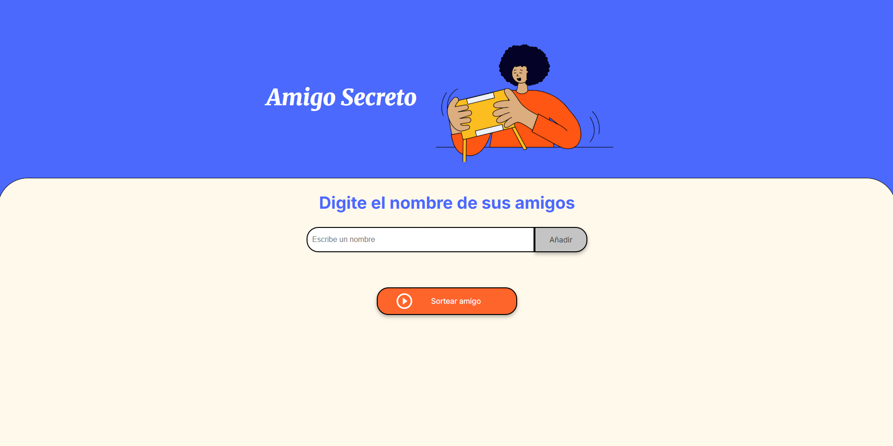

# Amigo Secreto 



>## Descripción

Este proyecto es una aplicación web sencilla para organizar un sorteo de "Amigo Secreto" entre un grupo de amigos. Permite agregar participantes y realizar sorteos aleatorios de forma sencilla y visual.

>## Características principales

- Agrega nombres de participantes dinámicamente.
- Visualiza la lista de participantes agregados.
- Realiza el sorteo de un amigo secreto de manera aleatoria.
- Interfaz amigable y moderna.

>## Tecnologías utilizadas

- HTML5
- CSS3
- JavaScript (Vanilla)

>## Estructura del proyecto

```
challenge-amigo-secreto/
├── assets/ # Imágenes y recursos estáticos
│   ├── paginaPrincipal.png                
│   ├── amigo-secreto.png
│   └── play_circle_outline.png
├── app.js                   # Lógica principal de la aplicación
├── index.html               # Página principal
├── style.css                # Estilos personalizados
└── README.md                # Documentación del proyecto
```

>## Instalación y uso de manera local

1. **Clona este repositorio:**
   ```bash
   git clone https://github.com/LordAguaKate/challenge-amigo-secreto.git
   ```
2. **Abre el proyecto:**
   - Puedes abrir el archivo `index.html` directamente en tu navegador web favorito.
   - No requiere instalación de dependencias ni servidores adicionales.

>## ¿Cómo funciona?

1. Ingresa el nombre de cada participante y haz clic en "Añadir".
2. Cuando todos los nombres estén agregados, haz clic en "Sortear amigo" para seleccionar aleatoriamente un participante.
3. El resultado aparecerá en pantalla. Puedes repetir el sorteo hasta que todos hayan sido seleccionados.

>## Ejemplo visual

https://github.com/user-attachments/assets/c59bae37-e46d-45b1-98d2-522543a8a926

>## Contribuciones

¡Las contribuciones son bienvenidas! Si deseas mejorar la aplicación, por favor abre un issue o un pull request siguiendo las buenas prácticas de desarrollo.


>## Autor

Desarrollado por [LordAguaKate](https://github.com/LordAguaKate) como parte de un desafío de lógica de programación de [Oracle Next Education](https://www.oracle.com/mx/education/oracle-next-education/)  y  [Alura](https://www.aluracursos.com/) .
